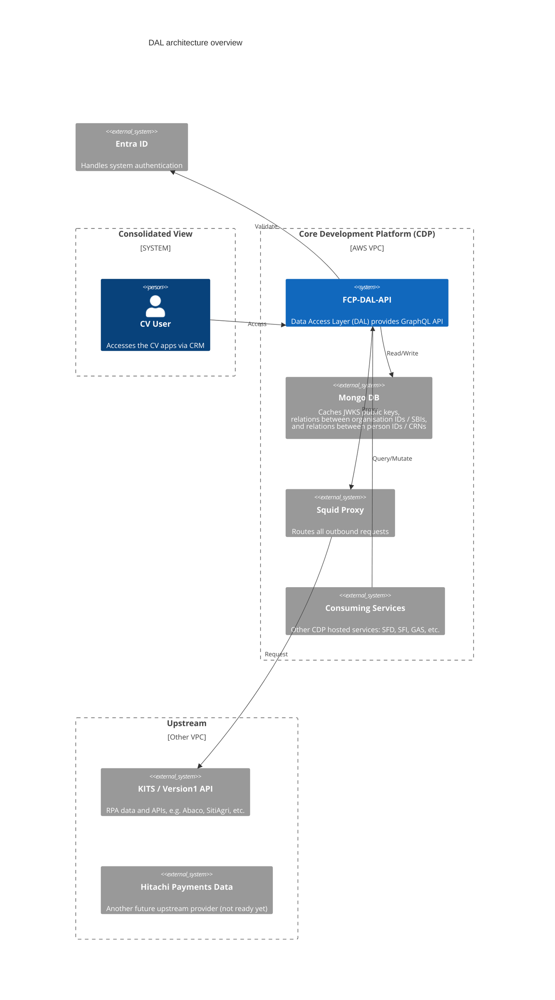
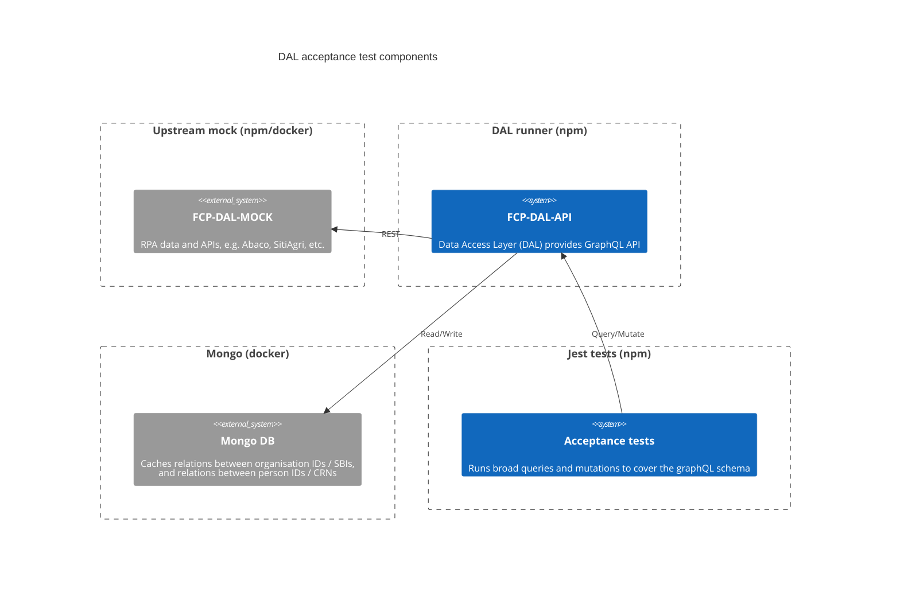
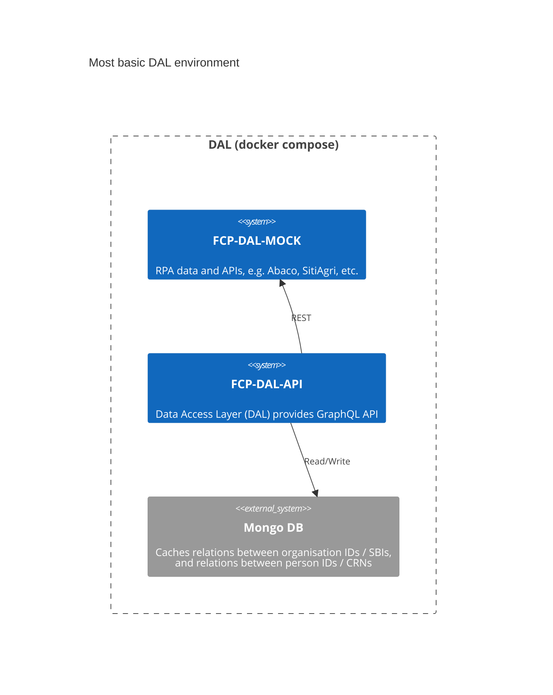
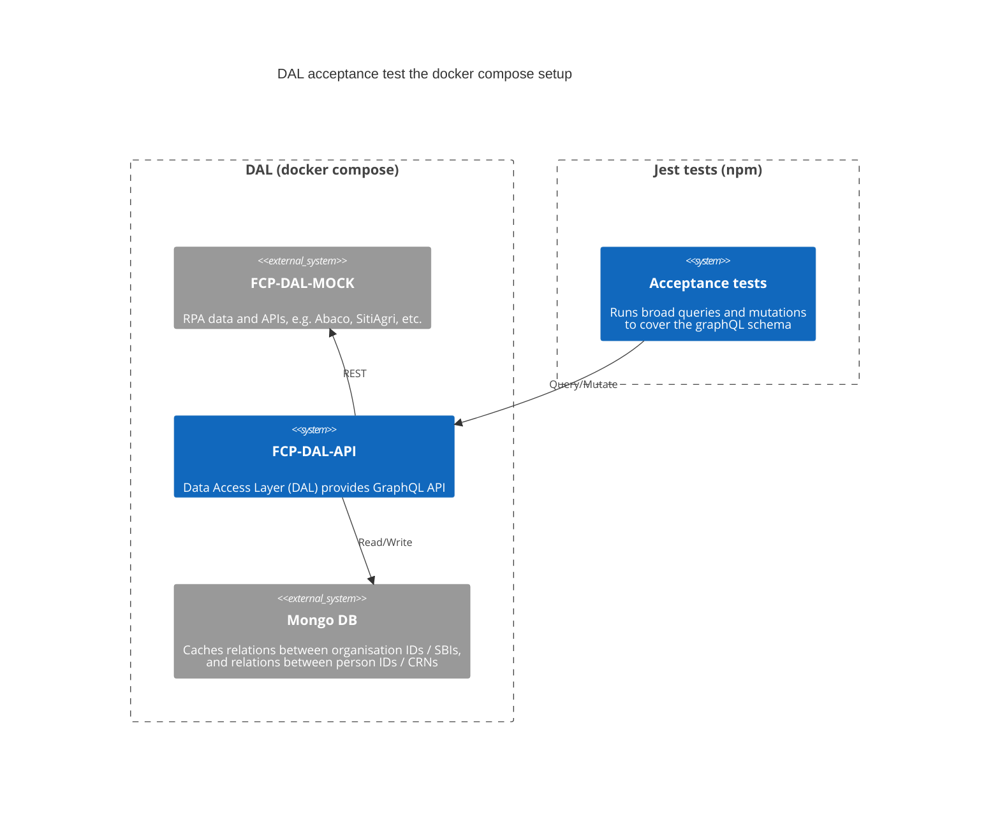
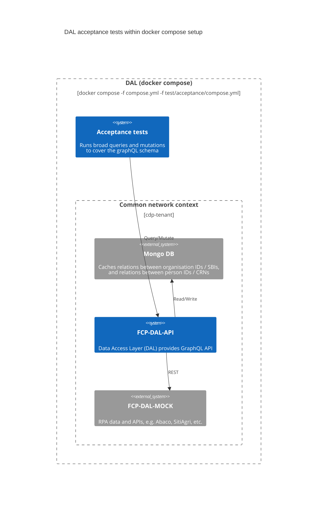
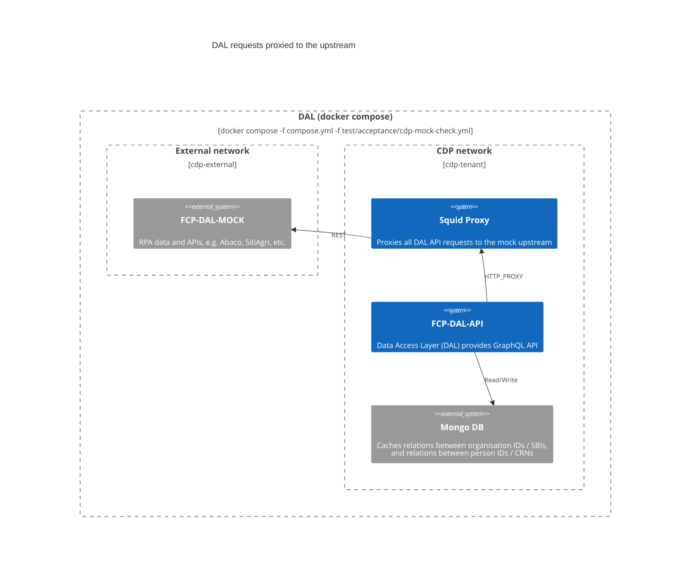
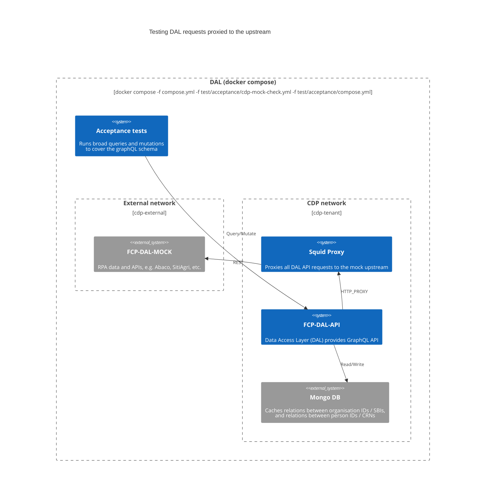
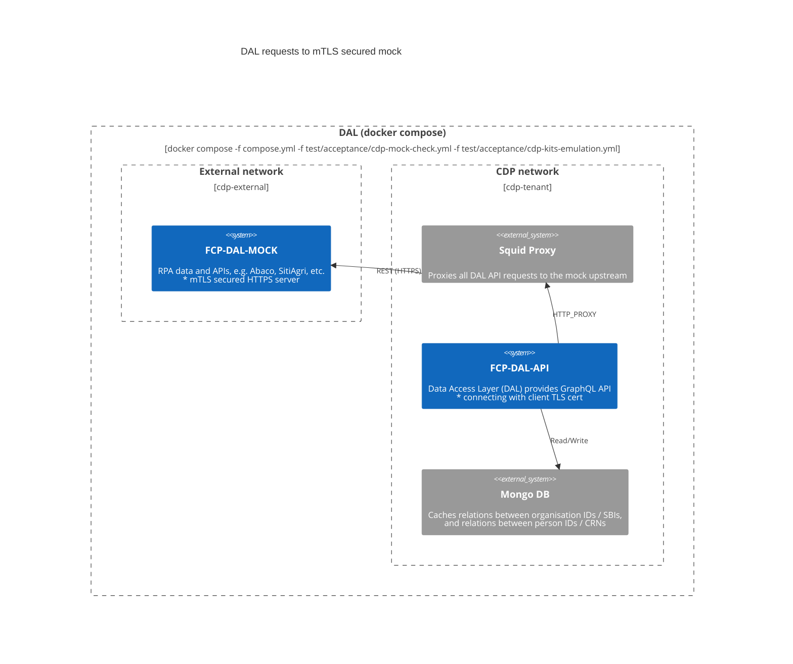

# DAL Architecture

## An overview

The DAL provides a graphQL API and is deployed on the Core Development Platform (CDP).
The platform provides various components, but the DAL only really makes use of MongoDB (for caching) and the outbound (Squid proxy) to make requests for data from the upstream providers.

### Upstream

Currently the only upstream provider is KITS/Version1 who supply RPA data; organisation and people details, plus Abaco, SitiAgri, and more APIs.
The DAL supports a subset of the available endpoints, but more are added as the need arises.
A second upstream API is planned (but not yet implemented), to get payments and accounts data form Hitachi.

### Downstream

Originally the DAL's only consuming service was the Consolidated View (CV) screens - a set of Power Apps delivered to DEFRA call centre staff via the CRM - but Single Front Door (SFD) and other integrations are underway...



## Testing strategy

The rest of this document explains how the DAL and associated components are configured to mimic the live CDP environments using `docker compose`, to give developers greater confidence when making changes...

Generally the project aims to _"shift-left"_ (in line with the Platform and Programme expectations).
High unit test coverage is maintained and a [threshold set at 95%](../jest.config.json#L10), which helps assure the proper function of the app code. However there is only so much that can be practically tested at the unit level; the following describes the resources and routes to more fully test configuration and [virtualised] infrastructure.

### Acceptance testing

Configuring and starting the DAL API is covered in the main project [`README.md`](../README.md), but as a developer it is quite common to start the [mock](https://github.com/DEFRA/fcp-dal-upstream-mock) (for the upstream data requirement) and then running (or debugging) the DAL API:

```shell
npm start
```

The acceptance tests are run separately to ensure the systems under test are closed and cannot be interfered with by the tests:

```shell
npm run test:acceptance
```



Although a common and basic use case, this setup requires a deeper knowledge of the DAL and its mock, but there is a `docker compose` setup to simplify this...

### Basic docker compose setup

A [`compose.yml`](../compose.yml) file exists to setup the most fundamental components to run the DAL:

```shell
docker compose up
```

> NOTE: you will probably want to add the `--no-attach mongodb` option if running this way and not detaching, because Mongo is extremely noisy!



Again the acceptance tests can be run against this setup (as before) by running `jest`:

```shell
npm run test:acceptance
```



### Acceptance tests in docker compose

As a further convenience, the acceptance tests can be run with a single command, which simplifies local testing and CI alike:

```shell
npm run test:acceptance:docker
```



In this case the acceptance tests are added as a layer on top of the existing setup by adding [an extra "override"](../test/acceptance/compose.yml) file to the `docker compose` context:

```shell
docker compose -f compose.yml -f test/acceptance/compose.yml run test
```

> NOTE: this also allows configuration and infrastructure complexity to be built up by adding components in further layers...

### Emulating CDP (dev)

After local testing and CI the first "live" environment is CDP `dev`, which brings extra configuration and infrastructure, particularly a [Squid] proxy through which all outbound traffic must connect.
The proxy behaviour (and associated configuration) can be added in to the basic `docker compose` setup by including the [`cdp-mock-check.yml`](../test/acceptance/cdp-mock-check.yml) override:

```shell
docker compose -f compose.yml -f test/acceptance/cdp-mock-check.yml up
```

> NOTE: again either run detached (`-d`), or silence MongoDB (`--no-attach mongodb`).



Again the acceptance tests can be mixed in to confirm this setup continues to work as intended, and can be run with the convenience script:

```shell
npm run test:acceptance:proxy
```



### Emulating CDP (test+)

Beyond the `dev` environment; `test`, `ext-test`, and `prod` connect to their upstream environments (KITS `upgrade`, `perf`, and `prod` respectively), NOT the mock. The real upstream gateways are TLS secured, and expect client connections to present client TLS certificates too (i.e. mutual TLS). The DAL API and its mock support this type of connection, so by again adding another compose override file ([`cdp-kits-emulation.yml`](../test/acceptance/cdp-kits-emulation.yml)) their configuration can be adjusted to mimic the live environments.



This setup requires valid TLS assets loaded into environment variables; to make this easier, and to avoid the need to otherwise keep/distribute these assets, there is a convenience script [`emulate-full-cdp.sh`](../test/acceptance/emulate-full-cdp.sh). The script generates fresh valid TLS assets _Just in Time_ (JiT), loads them into the `docker compose` environment, and then cleans them up afterwards too; allowing ephemeral CDP emulation!

```shell
emulate-full-cdp.sh up
```

Again the acceptance tests can be run against the ephemeral CDP setup, running either of the following commands:

```shell
emulate-full-cdp.sh test

npm run test:acceptance:proxy:mtls
```

> NOTE: should the test run fail; the docker compose shutdown and TLS asset clean-up processes are skipped and the environment left in tact ready for analysis and debugging 🔬
