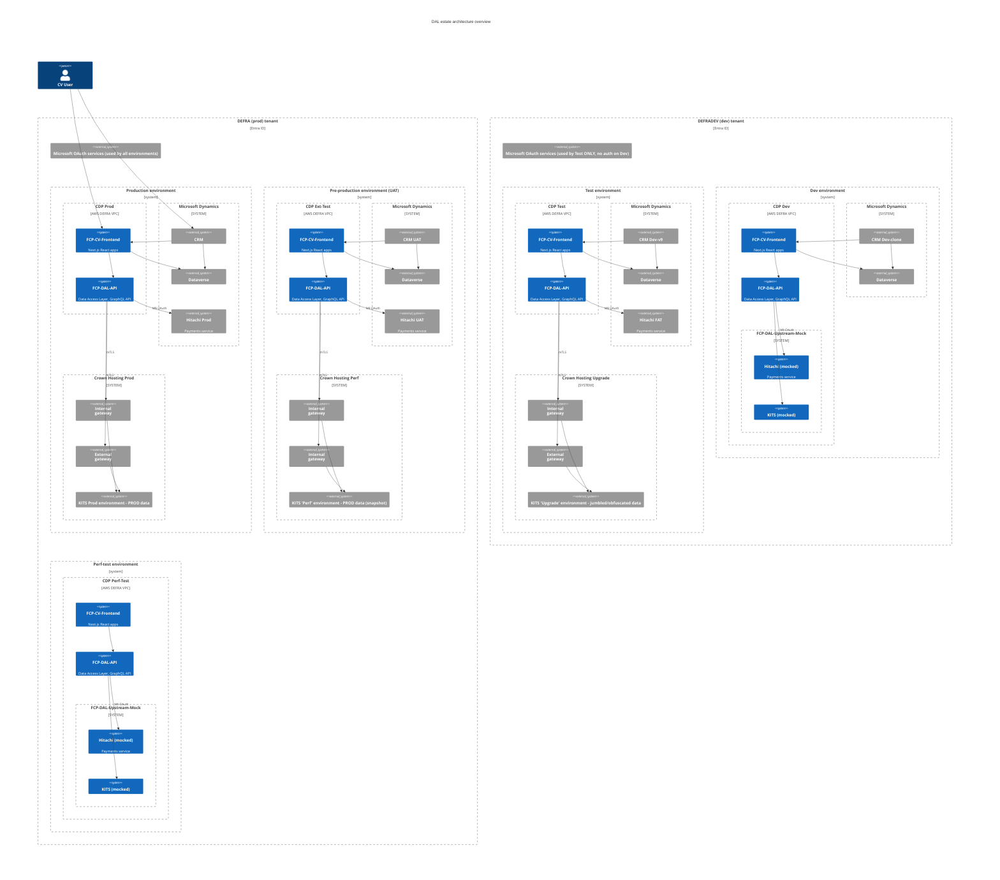

# DAL environments overview

The <abbr title="Data Access Layer">DAL</abbr> API provides data from upstream services (KITS/Version1 & Hitachi) to its consumers, e.g. <abbr title="Consolidated View">CV</abbr> service.
While CV and the DAL are hosted on <abbr title="Core Development Platform">CDP</abbr> with mirrored environments, the other systems they depend upon have very different structures; the diagram below shows the flow of data and how the various component services interact:

